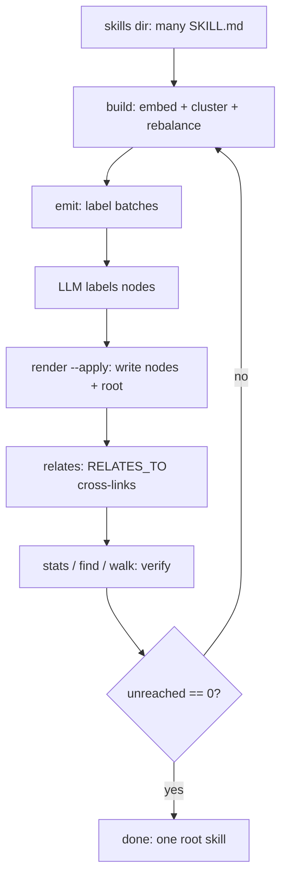
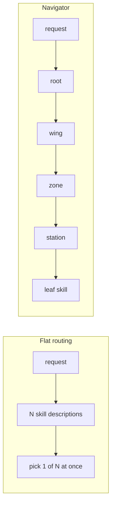
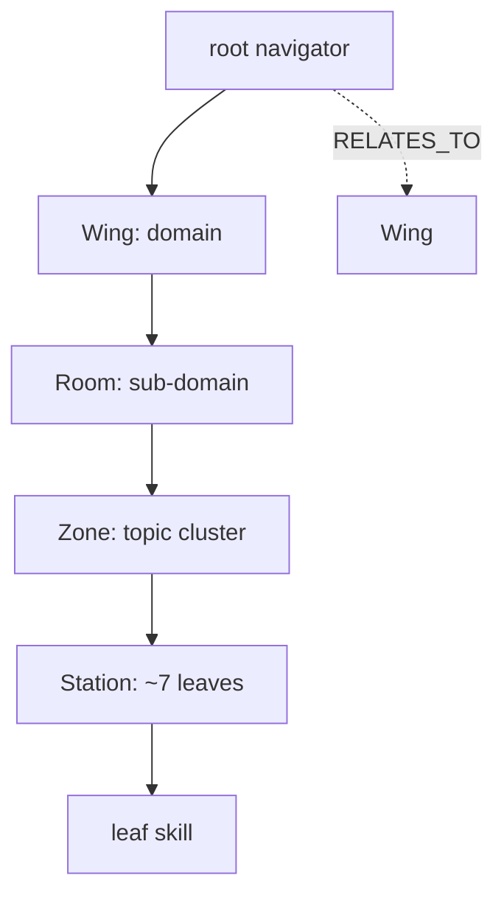
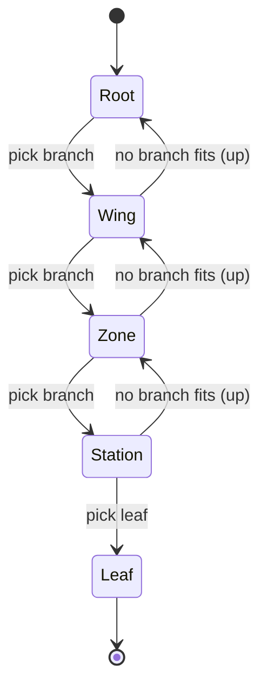

# skill-navigator

> One entry skill that routes an agent through a decision tree to the right
> `SKILL.md`, so a skills folder of any size stays usable.

**Languages:** [English](README.md) · [中文](README.zh.md)

**Topics:** Claude Code skills · Agent Skills · `SKILL.md` router · skill overload
· progressive disclosure · MCP tool overload · Codex plugins · skills directory

## The problem: skill overload

Agent Skills load by [progressive disclosure](https://platform.claude.com/docs/en/agents-and-tools/agent-skills/overview):
the agent sees only each skill's name and description (about 30-50 tokens) until
it picks one, then reads the full `SKILL.md`. That works for a dozen skills. It
falls apart at hundreds or thousands:

- The always-on metadata list grows past the context budget on its own.
- Description-only routing gets unreliable once many skills sound alike (ten
  flavors of "review", forty of "Kündigung").
- You cannot delete skills to reclaim context, because you still need them
  reachable.

You want every skill at hand *and* a small context. Those two goals pull against
each other.

## What skill-navigator does

skill-navigator adds a second layer of progressive disclosure. It builds **one
root skill** the agent enters, then routes tier by tier through a decision tree
until it lands on the right leaf skill. The agent loads the root (about 30-50
tokens) plus the handful of nodes on its path, never the whole catalog.

Hierarchy: **Wing** (domain) → **Room** (sub-domain) → **Zone** (topic) →
**Station** (~7 leaves) → **leaf skill**. Each internal node carries a routing
question, branch keyword hints, relative links to its children, an *"Up one
level"* backlink for backtracking, and `RELATES_TO` cross-links to near branches.

Point it at 8 skills or 25,000. The root stays the only entry an agent has to
discover. See the [German-law worked example](examples/claude-fuer-deutsches-recht/README.md)
for a 25,000-skill corpus reduced to one navigable root.

## Features

- Embeds each leaf skill from `folder-name + description`.
- Clusters skills top-down with k-means into a bounded 4-tier tree.
- Accepts nested skill *trees* (`--discover tree|flat`), not just flat dirs.
- Rebalances so every node has **≥3 children** and every leaf-holder **≥3 leaves**
  (no 1-child chains, no lonely leaves).
- Emits JSON batches so an LLM workflow can label internal nodes.
- Renders one decision-node `SKILL.md` plus `_manifest.json` per node, **flat or
  nested on disk** (`--layout`; flat is marketplace-safe).
- Adds an **"Up one level"** backlink so an agent backtracks when no branch fits.
- Marks generated nodes with `"navigator": true`, so rebuilds replace
  navigator-owned directories.
- Provides `walk`, `find`, and `stats` commands for verification.

## How it works

The pipeline runs build, label, render, then verify, looping until every leaf is
reachable:



Flat routing forces one pick against the whole corpus; the navigator turns it
into a few bounded hops:



The 4-tier hierarchy, with data-driven cross-links between near branches:



Traversal is a state machine: descend on a match, **go back up** when no branch
fits:



## Requirements

- Python 3.10+
- `sentence-transformers`
- `scikit-learn`
- `numpy`

## Install as a Plugin

Claude Code can install this repo as a marketplace:

```bash
claude plugin marketplace add neXenio/skill-navigator
claude plugin install skill-navigator@skill-navigator
```

Codex can install the same repository as a Git marketplace:

```bash
codex plugin marketplace add neXenio/skill-navigator
codex plugin add skill-navigator@skill-navigator
```

The installed plugin contributes the `skill-navigator` skill. The CLI still
runs as a separate Python command because it embeds and clusters your local
skills directory.

## Run the CLI with uvx

Use `uvx` when you want the command without cloning the repo:

```bash
uvx --from git+https://github.com/neXenio/skill-navigator skillnav --help
```

Run it against your skills directory:

```bash
DIR=/path/to/skills
WORK=/tmp/skillnav

uvx --from git+https://github.com/neXenio/skill-navigator skillnav --skills-dir "$DIR" --work "$WORK" build --wings 9
uvx --from git+https://github.com/neXenio/skill-navigator skillnav --skills-dir "$DIR" --work "$WORK" emit
# Label $WORK/labels_in/*.json into $WORK/labels_out/*.json.
uvx --from git+https://github.com/neXenio/skill-navigator skillnav --skills-dir "$DIR" --work "$WORK" render --root navigator --lang en --apply
uvx --from git+https://github.com/neXenio/skill-navigator skillnav --skills-dir "$DIR" --work "$WORK" relates --lang en
uvx --from git+https://github.com/neXenio/skill-navigator skillnav --skills-dir "$DIR" --work "$WORK" stats --root navigator
```

## Example Use

Suppose your skills live in `~/agent-skills`:

```text
~/agent-skills/
  api-review/SKILL.md
  bug-triage/SKILL.md
  database-migration/SKILL.md
  dependency-upgrade/SKILL.md
  incident-report/SKILL.md
  performance-audit/SKILL.md
  release-notes/SKILL.md
  test-generation/SKILL.md
```

Build a navigator over those skills:

```bash
DIR=~/agent-skills
WORK=/tmp/skillnav-agent-skills

uvx --from git+https://github.com/neXenio/skill-navigator skillnav --skills-dir "$DIR" --work "$WORK" build --wings 3
uvx --from git+https://github.com/neXenio/skill-navigator skillnav --skills-dir "$DIR" --work "$WORK" emit
```

Label the files in `$WORK/labels_in/` with your preferred LLM workflow and write
matching JSON files into `$WORK/labels_out/`. Then render and verify:

```bash
uvx --from git+https://github.com/neXenio/skill-navigator skillnav --skills-dir "$DIR" --work "$WORK" render --root team-navigator --lang en --apply
uvx --from git+https://github.com/neXenio/skill-navigator skillnav --skills-dir "$DIR" --work "$WORK" stats --root team-navigator
uvx --from git+https://github.com/neXenio/skill-navigator skillnav --skills-dir "$DIR" --work "$WORK" find "database" --root team-navigator
```

Your skills directory now includes generated navigator folders, for example:

```text
~/agent-skills/
  team-navigator/SKILL.md
  wing-platform/SKILL.md
  stn-database-work/SKILL.md
  api-review/SKILL.md
  database-migration/SKILL.md
  ...
```

In your agent, invoke `team-navigator`. The agent reads its branch list, follows
the linked child `SKILL.md` files, and ends at the matching leaf skill.

## Worked Example: German Law Skills

[`examples/claude-fuer-deutsches-recht/`](examples/claude-fuer-deutsches-recht/README.md)
runs the navigator over a large real-world corpus,
[Klotzkette/claude-fuer-deutsches-recht](https://github.com/Klotzkette/claude-fuer-deutsches-recht)
(~230 plugins / ~25,672 skills). It **references** the upstream skills (nothing
is copied), shows the generated node structure, walks a traversal, and includes
before/after diagrams plus token-safety and retrieval-effectiveness analysis.

Thanks to [Klotzkette](https://github.com/Klotzkette) for that collection, which
inspired the example.

## Install from a Clone

```bash
git clone https://github.com/neXenio/skill-navigator.git
cd skill-navigator
python3 -m venv .venv
. .venv/bin/activate
pip install -r requirements.txt
```

## Apply to a Skills Directory

Point the CLI at the directory that contains your existing skill folders. Each
leaf skill must be a directory with a `SKILL.md` file. Generated navigator nodes
are written into the same skills directory.

Use a scratch directory for build artifacts:

```bash
PY=.venv/bin/python
DIR=/path/to/skills
WORK=/tmp/skillnav

$PY scripts/skillnav.py --skills-dir "$DIR" --work "$WORK" build --wings 9
$PY scripts/skillnav.py --skills-dir "$DIR" --work "$WORK" emit
# Label $WORK/labels_in/*.json into $WORK/labels_out/*.json.
$PY scripts/skillnav.py --skills-dir "$DIR" --work "$WORK" render --root navigator --lang en --apply
$PY scripts/skillnav.py --skills-dir "$DIR" --work "$WORK" relates --lang en
$PY scripts/skillnav.py --skills-dir "$DIR" --work "$WORK" stats --root navigator
```

The generated root skill is user-invokable. Agents reach generated wing, room,
zone, and station reference nodes by reading child `SKILL.md` files during traversal.

## Run as a User

After `render --apply`, your skills directory contains a new root skill, named
`navigator` in the example above. Invoke that skill in your agent environment,
then answer the routing question at each level. The agent follows the linked
child `SKILL.md` files until it reaches the leaf skill that matches the request.

To rebuild, rerun the same command sequence. `render --apply` replaces previous
navigator-generated directories and keeps source skills untouched.

## Commands

- `build`: embed leaf skills and create the tree.
- `emit`: write node-labeling batches into `$WORK/labels_in`.
- `render`: write generated navigator nodes and the root skill.
- `relates`: inject cross-branch links based on centroid similarity.
- `walk`: print the generated navigation tree.
- `find`: print navigation paths matching a term.
- `stats`: report tree counts and unreached leaves.

## Development

Run the regression tests with the standard library test runner:

```bash
python3 -m unittest discover -s tests
python3 -m py_compile scripts/skillnav.py tests/test_skillnav.py
```

## License

MIT
