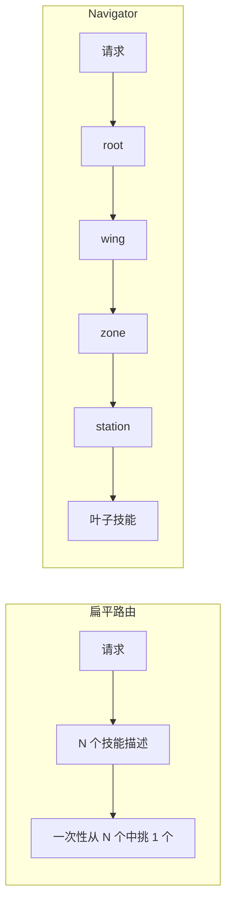

# skill-navigator

> 一个入口技能，通过决策树把 agent 路由到正确的 `SKILL.md`，让任意规模的技能目录都保持可用。

**语言：** [English](README.md) · [中文](README.zh.md)

**主题：** Claude Code 技能 · Agent Skills · `SKILL.md` 路由器 · 技能过载 ·
渐进式披露（progressive disclosure）· MCP 工具过载 · Codex 插件 · 技能目录

## 问题：技能过载

Agent Skills 采用[渐进式披露](https://platform.claude.com/docs/en/agents-and-tools/agent-skills/overview)加载：
agent 默认只看到每个技能的名称和描述（约 30-50 个 token），选定后才读取完整的
`SKILL.md`。这在几十个技能时运作良好，但到了几百、几千个就会崩溃：

- 始终常驻的元数据列表本身就会超出上下文预算。
- 当大量技能听起来相似时（十种「review」、四十种「Kündigung」），仅凭描述的路由变得不可靠。
- 你无法为了节省上下文而删除技能，因为你仍然需要它们随手可用。

你既想让每个技能随手可用，又想保持上下文精简。这两个目标互相拉扯。

## skill-navigator 做什么

skill-navigator 增加了第二层渐进式披露。它生成**一个根技能**供 agent 进入，
然后逐层通过决策树路由，直到落在正确的叶子技能上。Agent 只加载根节点
（约 30-50 个 token）加上路径上的少数节点，从不加载整个目录。

层级结构：**Wing**（领域）→ **Room**（子领域）→ **Zone**（主题）→
**Station**（约 7 个叶子）→ **叶子技能**。每个内部节点都包含一个路由问题、
分支关键词提示、指向子节点的相对链接、用于回溯的「Up one level」返回链接，
以及指向相邻分支的 `RELATES_TO` 交叉链接。

无论指向 8 个技能还是 25,000 个，根节点始终是 agent 唯一需要发现的入口。
完整示例见[德国法律技能示例](examples/claude-fuer-deutsches-recht/README.md)：
一个 25,000 技能的语料库被收敛为一个可导航的根。

## 特性

- 用 `folder-name + description` 嵌入每个叶子技能。
- 用 k-means 自顶向下聚类为有界的 4 层树。
- 接受嵌套的技能**树**（`--discover tree|flat`），不仅是扁平目录。
- 重新平衡：每个节点 **≥3 个子节点**，每个叶子持有者 **≥3 个叶子**
  （没有单子链，没有孤立叶子）。
- 输出 JSON 批次，供 LLM 工作流为内部节点打标签。
- 每个节点渲染一个决策节点 `SKILL.md` 加 `_manifest.json`，**磁盘上可扁平或嵌套**
  （`--layout`；扁平对 marketplace 安全）。
- 添加**「Up one level」**返回链接，当没有分支匹配时让 agent 回溯。
- 用 `"navigator": true` 标记生成节点，重建时替换 navigator 拥有的目录。
- 提供 `walk`、`find`、`stats` 命令用于验证。

## 工作原理

流水线依次运行 build、label、render、verify，循环直到每个叶子都可达。
四张图（流水线、扁平对比导航、4 层层级、带回溯的遍历）见
[英文 README](README.md#how-it-works)。所有图均为 Mermaid，在 GitHub 上直接渲染。



## 安装与使用

安装、`uvx` 运行、CLI 工作流（build → emit → label → render → relates → verify）
的完整命令见[英文 README](README.md)；命令本身与语言无关。技能文档见
[`skills/skill-navigator/SKILL.md`](skills/skill-navigator/SKILL.md)。

```bash
claude plugin marketplace add neXenio/skill-navigator
claude plugin install skill-navigator@skill-navigator
```

## 致谢

感谢 [Klotzkette](https://github.com/Klotzkette) 的
[claude-fuer-deutsches-recht](https://github.com/Klotzkette/claude-fuer-deutsches-recht)
技能集，它启发了本仓库的示例。

## 许可证

MIT
