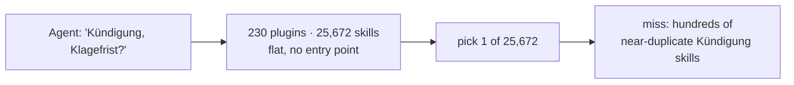
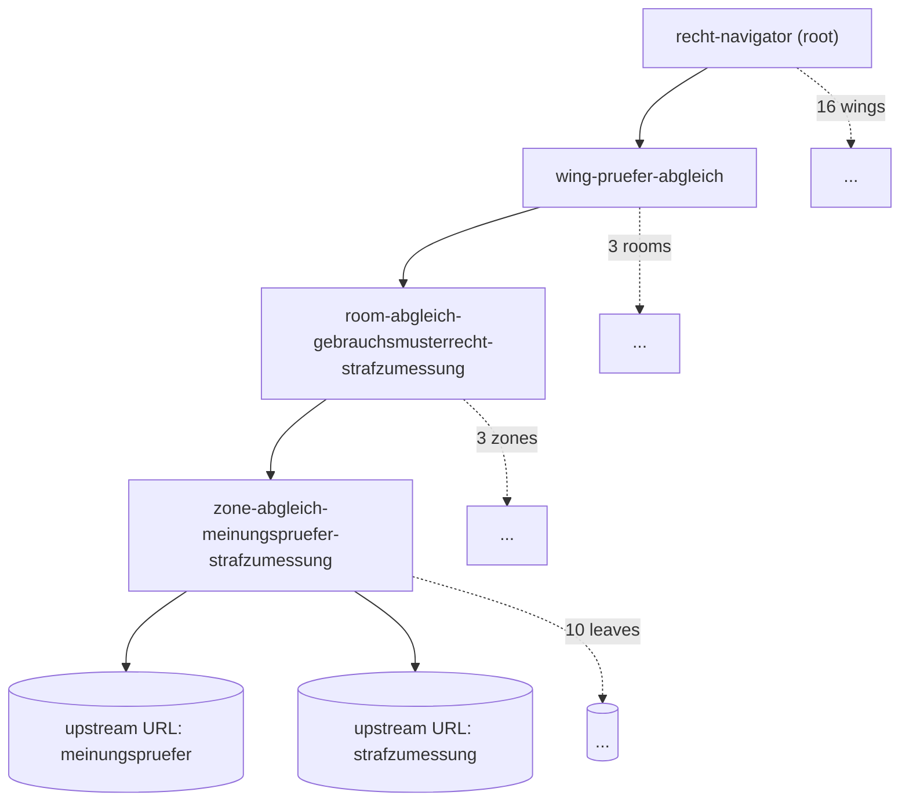
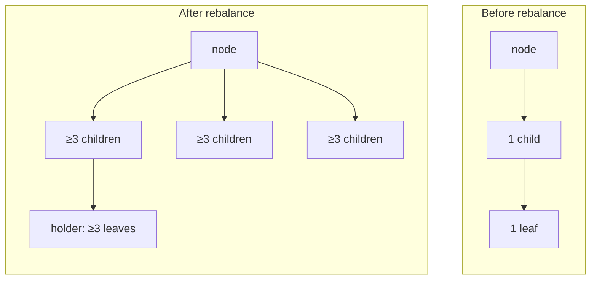
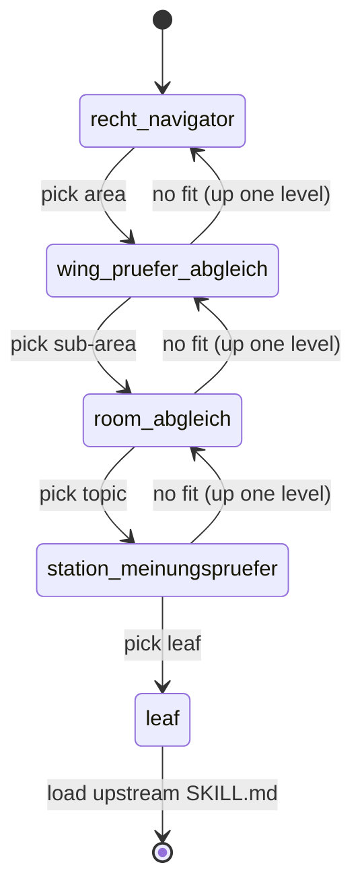

# Example: a navigator over `claude-fuer-deutsches-recht`

This example shows what `skill-navigator` produces when pointed at the
[**Klotzkette/claude-fuer-deutsches-recht**](https://github.com/Klotzkette/claude-fuer-deutsches-recht/tree/main)
skill collection, **~230 plugins / ~25,672 leaf skills** of German-law workflows.

> Full before/after tree visualization: [`VIZ.md`](./VIZ.md).

> **Reference, not copy.** Nothing from the upstream repo is vendored here. The
> leaf branches in this example point at the **original upstream paths** instead
> of local `../<leaf>/SKILL.md` files. The only files in this folder are the
> small *navigator nodes* that `skill-navigator` itself generates, the decision
> tree, not the skills. To run it for real, clone the upstream repo and point the
> CLI at its skills directory (see [How to reproduce](#how-to-reproduce)).

See [`REFERENCES.md`](./REFERENCES.md) for the leaf → upstream-path map.

---

## Why a navigator here

`claude-fuer-deutsches-recht` is a textbook case for `skill-navigator`: thousands
of densely-related legal skills where flat description-routing collapses. You
cannot hand an agent 25k skill descriptions and expect a clean pick.

### Before, flat list of 230 skill trees



Every routing decision competes against the entire corpus at once. Legal skills
are near-synonyms by construction (Kündigung, Kündigungsschutz, Kündigungsfrist,
außerordentliche Kündigung…), so description cosine alone routes poorly.

### After, bounded, rebalanced decision tree (real generated nodes)

The committed example path (one of 16 wings; see [`VIZ.md`](./VIZ.md) for all):



Each hop is a choice among **3–12 branches**. The agent loads one small node per
level, never the whole corpus.

### Rebalanced: no 1-child chains, no lonely leaves

`build` enforces **≥3 children per node** and **≥3 leaves per holder**, degenerate
nodes are collapsed, tiny holders dissolved into the nearest sibling:



### Traversal with backtracking

Every non-root node carries an **"Up one level"** link; if no branch fits the
agent goes back up and tries a sibling instead of mis-routing:



---

## Output structure (one example path)

`render --apply --layout nested` writes the decision tree *nested on disk* under
the root. Generated nodes carry `_manifest.json` with `"navigator": true`; the
upstream leaf skills are never moved or copied, leaf branches link upstream URLs.

The **full** generated tree is 42 nodes (see [`VIZ.md`](./VIZ.md)). To keep this
folder small, [`navigator-generated/`](./navigator-generated) commits just **one
representative path**, a root → wing → room → station slice, each node linking
only its on-path child:

```text
recht-navigator/                                                 # root (wing branch)
└── wing-pruefer-abgleich/                                       # Area
    └── room-abgleich-gebrauchsmusterrecht-strafzumessung/       # Sub-area
        └── zone-abgleich-meinungspruefer-strafzumessung/        # leaf-holder
            └── SKILL.md  → 10 leaf branches, each an upstream URL
```

The four committed nodes:

- [root](./navigator-generated/recht-navigator/SKILL.md), entry, links the wing
- [wing](./navigator-generated/recht-navigator/wing-pruefer-abgleich/SKILL.md), Area decision node
- [room](./navigator-generated/recht-navigator/wing-pruefer-abgleich/room-abgleich-gebrauchsmusterrecht-strafzumessung/SKILL.md), Sub-area decision node
- [station](./navigator-generated/recht-navigator/wing-pruefer-abgleich/room-abgleich-gebrauchsmusterrecht-strafzumessung/zone-abgleich-meinungspruefer-strafzumessung/SKILL.md), leaf-holder, 10 upstream URLs

> Set `LAYOUT=flat` (or drop `--layout nested`) for a marketplace-safe flat tree
> where every node is a top-level sibling dir. Run `build.sh` to regenerate the
> full 42-node tree locally.

---

## How it is traversed

`find` prints the real path through the generated tree:

```bash
skillnav ... find "meinungspruefer" --root recht-navigator
# recht-navigator
#   → recht-navigator/wing-pruefer-abgleich
#     → …/room-abgleich-gebrauchsmusterrecht-strafzumessung
#       → …/zone-abgleich-meinungspruefer-strafzumessung
#         → meinungspruefer        (→ upstream SKILL.md)
```

At each node the agent reads one routing question + 3–12 keyword-hinted branches,
picks one, follows the relative link down. If no branch fits, the **"Up one
level"** link sends it back to the parent to try a sibling. `RELATES_TO`
cross-links catch borderline cases across branches (e.g. *Kündigung* ↔
*Aufhebungsvertrag* in a sibling zone).

---

## Token safety

Rough cost of reaching one leaf, both approaches (description ≈ 40 tokens, node ≈ 450 tokens):

| Approach            | Loaded to route                          | Tokens (approx) |
|---------------------|------------------------------------------|-----------------|
| Flat description list | all ~25,672 descriptions               | **~1,025,000**  |
| Navigator traversal | 5 nodes (root→station) + 1 leaf          | **~2,300**      |

≈ **400× fewer tokens** to make the same routing decision, and the navigator cost
is *flat* in corpus size, depth stays 4–5 regardless of whether the repo holds
25k or 250k skills. The flat list grows linearly and eventually does not fit in
context at all (1M+ tokens here already exceeds a single window).

## Retrieval effectiveness

- **Bounded fan-out.** Every decision is among 3–12 branches, not 25,672. Legal
  near-synonyms are separated *one tier up*, so the hard discriminations happen
  in tiny candidate sets where keyword hints actually disambiguate.
- **Semantic clustering, not alphabetic.** `build` embeds `folder-name +
  description` and k-means-clusters top-down, so *Kündigungsfrist* and
  *Kündigungsschutzklage* land in the same station even though they sort far
  apart alphabetically.
- **No dead ends.** `stats` reports `unreached=0`, every upstream leaf is
  reachable from the root. `find` proves any single path.
- **Borderline recovery.** Data-driven `RELATES_TO` links (centroid cosine,
  cross-branch) give the agent an escape hatch when a request straddles two
  branches, instead of silently routing to the wrong one.

---

## The upstream is a tree of skill *trees*

The upstream repo does **not** keep skills as flat top-level dirs. All **25,672**
`SKILL.md` files sit at depth 4: `<plugin>/skills/<skill>/SKILL.md`, across **213**
plugins. `skill-navigator`'s `--discover` flag handles this:

- `--discover tree`, each top-level plugin is **one** leaf (**213** leaves). Fast;
  the navigator routes to a plugin, which then routes internally. *(used below)*
- `--discover flat`, every nested skill is a leaf (**25,672** leaves). A full
  *resort* of the whole corpus into one fresh 4-tier navigator.

## How to reproduce

The script [`build.sh`](./build.sh) does the whole pipeline, clone → build →
emit → label → render → **relink leaves to upstream URLs** → export a
navigator-only tree (no upstream files copied):

```bash
# tree mode, nested layout (each plugin = one leaf; fast)
bash build.sh

# marketplace-safe flat layout (disable nesting)
LAYOUT=flat bash build.sh

# full resort (every nested skill = a leaf, ~25,672)
DISCOVER=flat WINGS=24 WORKROOT=/tmp/skillnav-recht-flat \
  EXPORT="$PWD/navigator-generated-flat" bash build.sh
```

The labeling step in `build.sh` is a **deterministic placeholder** (terms →
Title Case) so the run is reproducible without an LLM; swap it for an LLM
labeling pass (see [`SKILL.md`](../../skills/skill-navigator/SKILL.md) step 3) for
production-quality node names.

### Generated proof output

Running `build.sh` here produced a real navigator from the live upstream
(`DISCOVER=tree`, `LAYOUT=nested`, `--lang de`): **42** nodes (16 wings · 16 rooms
· 9 zones + leaf-holders + root), nested on disk, every node ≥3 children, every
holder ≥3 leaves, `unreached=0`, **0** upstream files copied. Full shape in
[`VIZ.md`](./VIZ.md).

- [`navigator-generated/`](./navigator-generated), one representative root → wing
  → room → station path pruned out of that tree (the rest regenerates with
  `build.sh`).
- `navigator-generated-flat/`, `--discover flat`: the full ~25,672-leaf resort
  (generate locally with the command above; not committed for size).

Cluster boundaries and labels depend on the upstream revision and embedding run , 
the *shape* (4 tiers, bounded fan-out, ≥3 children, single root, `unreached=0`)
is what `skill-navigator` guarantees.

---

## Thanks

Huge thanks to **[Klotzkette](https://github.com/Klotzkette)**, author of
[**claude-fuer-deutsches-recht**](https://github.com/Klotzkette/claude-fuer-deutsches-recht),
whose large, richly-structured German-law skill collection inspired this example.
It is exactly the kind of corpus `skill-navigator` was built for. Please consult
that repository's own disclaimers, it is an experimental collection and **not
legal advice**.
