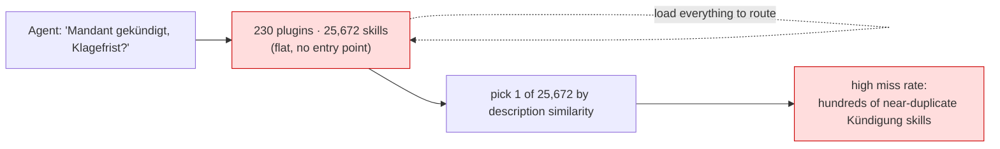
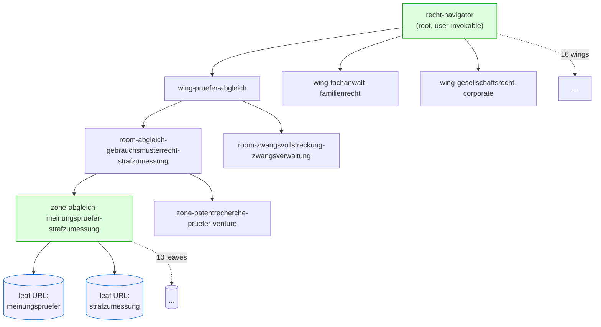

# Repo tree, before vs after

Live snapshot of [Klotzkette/claude-fuer-deutsches-recht](https://github.com/Klotzkette/claude-fuer-deutsches-recht)
and the navigator built over it with `build.sh` (`DISCOVER=tree`, `LAYOUT=nested`).

| | Before (upstream) | After (navigator, tree mode) |
|---|---|---|
| Top-level entries an agent faces | **230 plugins** | **1** root skill |
| Leaf `SKILL.md` files | **25,672** | unchanged (referenced, not moved) |
| Decision to make at once | 230-way (or 25,672-way) | **3–12-way** per hop |
| Generated nodes | n/a | **42** (16 wings · 16 rooms · 9 zones + holders + root) |
| Max depth to a leaf | flat-ish (plugin → skills/ → skill) | 4–6 hops, bounded |
| Min children / node | n/a | **3** |
| Min leaves / holder | 1 … 100+ per plugin | **3** |
| Unreached leaves | n/a | **0** |

---

## BEFORE, upstream is a flat list of 230 skill *trees*

Every plugin bundles its own `skills/<skill>/SKILL.md`. There is no top-level
guidance: an agent sees 230 sibling plugins (or, flattened, 25,672 skills).

```text
claude-fuer-deutsches-recht/
├── arbeitsrecht/                 # plugin = a skill tree
│   ├── README.md  agents/  ausloeser/  daten/
│   └── skills/                   # 98 leaf skills
│       ├── abmahnung-arbeitsrecht/SKILL.md
│       ├── agg-pruefung-bewerber-und-beschaeftigte/SKILL.md
│       └── … (96 more)
├── gesellschaftsrecht/
│   └── skills/                   # 107 leaf skills
│       └── …
├── datenschutzrecht/   skills/ …
├── insolvenzrecht/     skills/ …
└── … 226 more plugins …          # 25,672 SKILL.md total
```



---

## AFTER, one root, bounded fan-out, nested on disk

`skill-navigator` writes a 4-tier decision tree. With `LAYOUT=nested` the nodes
mirror the hierarchy on disk under the root; leaves stay where they are (here:
referenced by upstream URL).

```text
recht-navigator/                                                 # root, user-invokable
├── SKILL.md  _manifest.json
├── wing-pruefer-abgleich/
│   ├── SKILL.md                                                 # routing question + 3 rooms
│   ├── room-abgleich-gebrauchsmusterrecht-strafzumessung/
│   │   ├── SKILL.md                                             # 3 zones
│   │   ├── zone-abgleich-meinungspruefer-strafzumessung/SKILL.md   # holder → 10 upstream URLs
│   │   └── zone-patentrecherche-pruefer-venture/SKILL.md
│   └── room-zwangsvollstreckung-zwangsverwaltung-.../SKILL.md   # holder → 3 upstream URLs
├── wing-fachanwalt-familienrecht/
│   └── room-fachanwalt-medizinrecht-versicherungsrecht/SKILL.md
├── wing-gesellschaftsrecht-corporate/ …
└── … 16 wings total …
```



### Traversal (with backtracking)

Each node poses one question and lists 3–12 keyword-hinted branches; the agent
descends one link at a time. Every non-root node also carries an **"Up one
level"** link, if no branch fits, the agent goes back up and tries a sibling
instead of mis-routing.

```text
recht-navigator
  → wing-pruefer-abgleich            (1 of 16)
    → room-abgleich-gebrauchsmusterrecht-strafzumessung
      → zone-abgleich-meinungspruefer-strafzumessung
        → meinungspruefer    → load upstream SKILL.md
   (no branch fits? ../SKILL.md  ↑ back up, pick another)
```

> Labels above come from the deterministic placeholder labeler in `build.sh`
> (distinct terms → Title Case). An LLM labeling pass produces cleaner names;
> the **shape** is what matters here.
